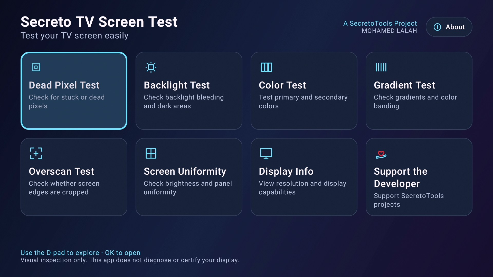
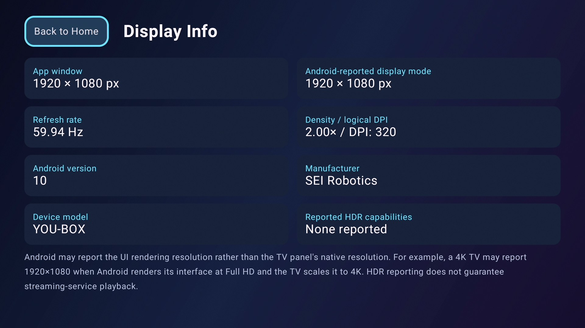
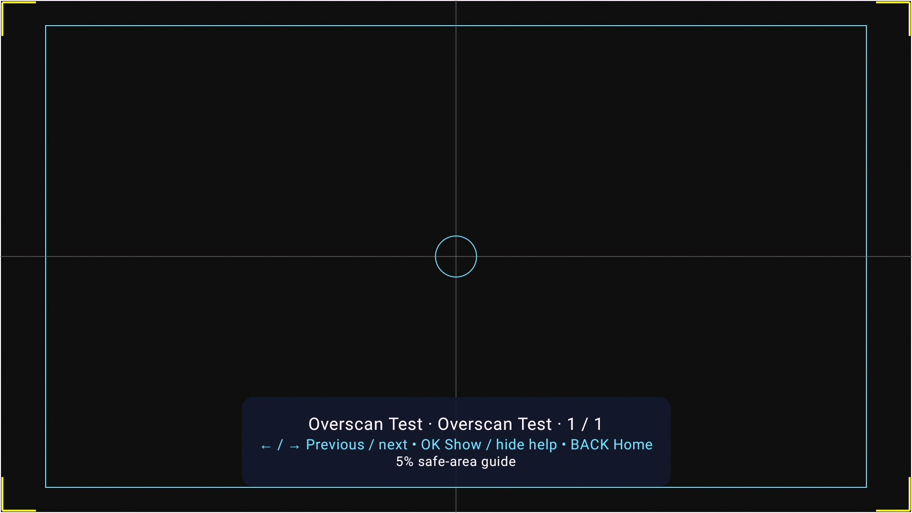
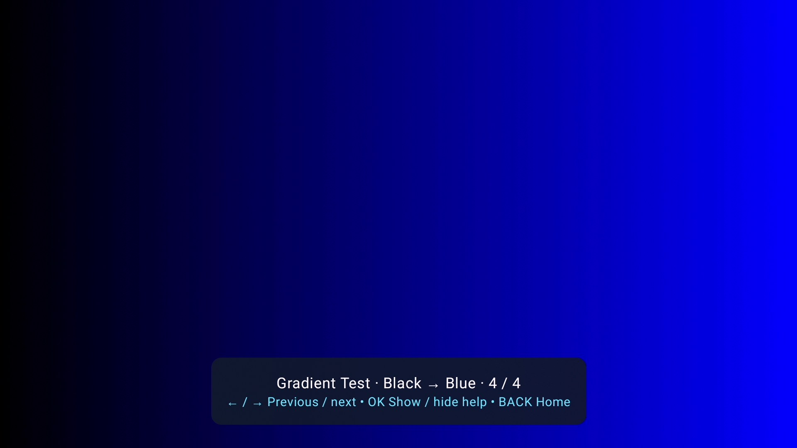

# Secreto TV Screen Test

**A TV-friendly screen testing and display diagnostics utility for Android TV & Google TV.**

Secreto TV Screen Test is designed to help users test their television or display directly from an Android TV or Google TV device.

The application provides a simple remote-control-friendly interface with screen testing tools, visual test patterns, and display information.

Developed by **Mohamed LALAH / SecretoTools**.

---
## Screenshots

### Home Screen

### Display Information

### Overscan Test

### Gradient Test

---

## Features

Secreto TV Screen Test includes multiple tools designed to help inspect and test a TV or display.

The application provides:

- Screen testing tools
- Visual test patterns
- Display information
- Full-screen testing experience
- TV-friendly navigation
- Remote-control / D-pad support
- Simple and lightweight interface

The application currently includes **8 screen tools and 6 visual tests**, together with display information and additional application information.

---

## Visual Tests

The included visual tests are designed to help users visually inspect different characteristics of their television or display.

Tests are presented directly on the screen and are optimized for use from Android TV and Google TV devices.

---

## Display Information

Secreto TV Screen Test includes a dedicated Display Info section that provides useful information about the connected display and the current Android TV / Google TV environment.

---

## Designed for Android TV & Google TV

The interface is designed specifically for television devices and remote-control navigation.

Features include:

- TV-friendly user interface
- D-pad / remote control navigation
- Large focusable elements
- Full-screen visual tests
- Lightweight design
- No account required
- No root required

---

## Languages

Secreto TV Screen Test currently supports:

- English
- Français
- Español
- العربية

The application automatically follows the language configured on the device.

---

## Installation

Official APK releases of Secreto TV Screen Test may be provided through the **Releases** section of this repository.

For security and authenticity, users should download the application only from official distribution channels published by **Mohamed LALAH / SecretoTools**.

Future official releases may also be distributed through Google Play.

---

## Source Code

The source code is publicly viewable for transparency, educational reference, and project documentation.

**Public availability of this repository does not make Secreto TV Screen Test an open-source project.**

Viewing, downloading, cloning, or forking this repository does not grant permission to redistribute, modify, republish, repackage, sell, sublicense, or publish the application or its source code except as explicitly permitted by the project license.

---

## License & Copyright

**Copyright © 2026 Mohamed LALAH / SecretoTools. All Rights Reserved.**

Secreto TV Screen Test is proprietary software.

Official compiled APK releases may be downloaded and used for personal, non-commercial use subject to the terms of the project license.

Unauthorized copying, modification, redistribution, repackaging, resale, or publication of this software or its source code is prohibited.

Publishing Secreto TV Screen Test, a modified version, derivative version, repackaged version, or substantially similar copy on **Google Play or any other application store or distribution platform** is not permitted without prior written authorization from **Mohamed LALAH / SecretoTools**.

See the [`LICENSE`](LICENSE) file for the complete terms.

---

## Third-Party Rights

Android, Google TV, Google Play, and other product names or trademarks mentioned in this project belong to their respective owners.

Third-party libraries and components used by the project remain subject to their respective licenses.

Secreto TV Screen Test is an independent project and is not affiliated with or endorsed by Google or device manufacturers unless explicitly stated otherwise.

---

## Developer

**Mohamed LALAH**

**SecretoTools**

Developer of Secreto TV Screen Test.

---

## Official Project

This GitHub repository is the official source repository for **Secreto TV Screen Test**.

Official releases and project information should be obtained from this repository or other distribution channels explicitly published by **Mohamed LALAH / SecretoTools**.

---

Copyright © 2026 Mohamed LALAH / SecretoTools  
**All Rights Reserved.**
